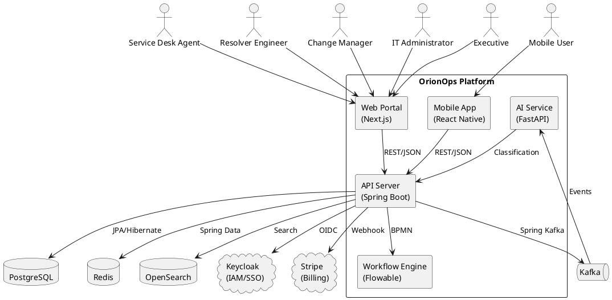
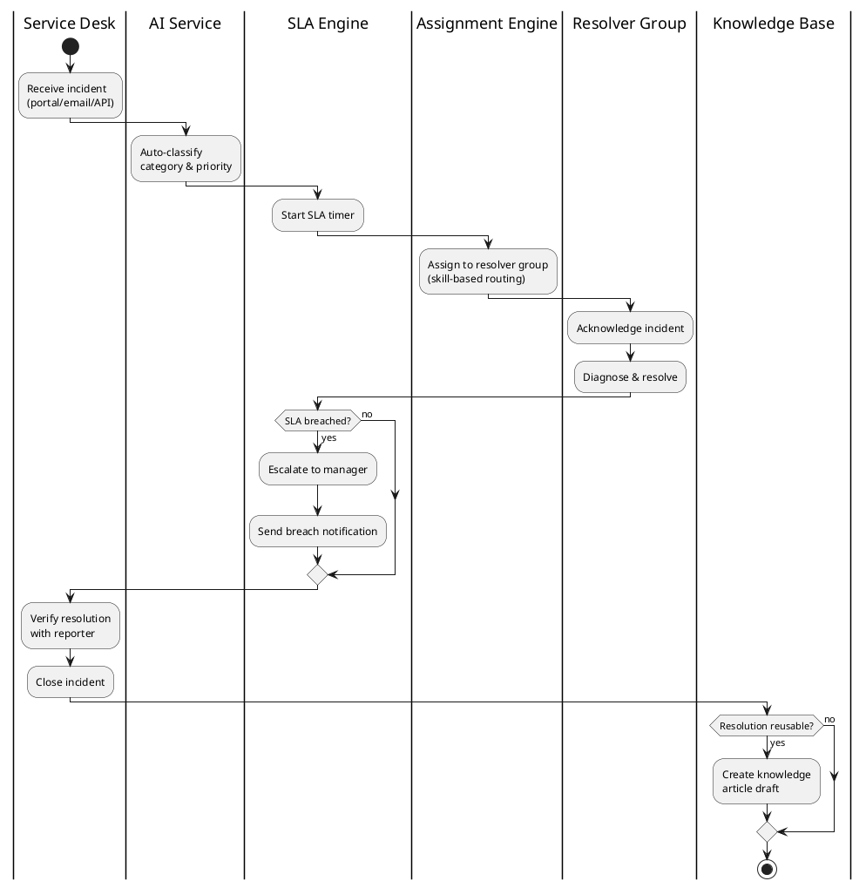
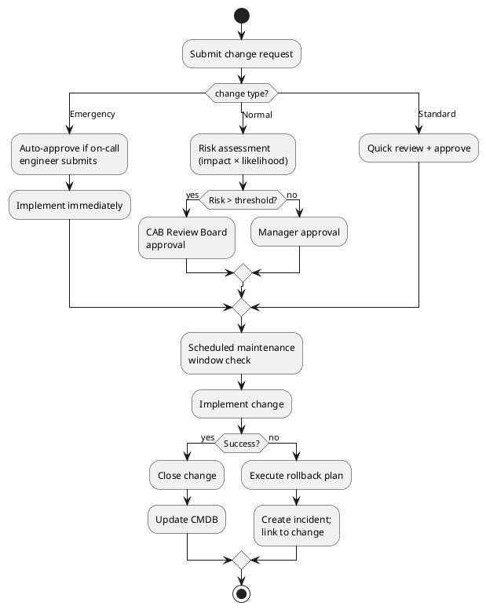
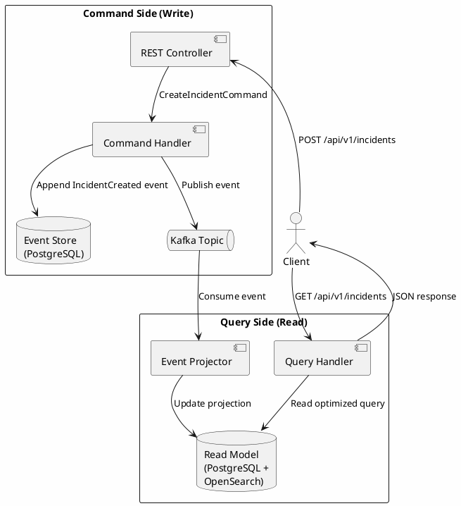
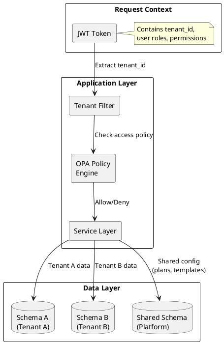

# OrionOps - Enterprise Service Orchestration Platform

> **ITSM Core + ERP Extensions + Observability + SaaS Multi-Tenancy**

An open-source, ISO 20000-aligned enterprise platform combining incident, problem, change, and request management with composable ERP modules (finance, procurement, inventory, vendor, workforce, billing) — all orchestrated through a BPMN workflow engine.

---

## Table of Contents

1. [Overview](#1-overview)
2. [Architecture Overview](#2-architecture-overview)
3. [Domain Design](#3-domain-design)
4. [Data Architecture](#4-data-architecture)
5. [Core Features](#5-core-features)
6. [AI & Intelligence Layer](#6-ai--intelligence-layer)
7. [Security & Authorization](#7-security--authorization)
8. [Scalability Strategy](#8-scalability-strategy)
9. [Reliability & Fault Tolerance](#9-reliability--fault-tolerance)
10. [Observability](#10-observability)
11. [API Design](#11-api-design)
12. [SaaS Billing (Stripe)](#12-saas-billing-stripe)
13. [DevOps & Deployment](#13-devops--deployment)
14. [Configuration & Feature Flags](#14-configuration--feature-flags)
15. [Testing Strategy](#15-testing-strategy)
16. [Performance Considerations](#16-performance-considerations)
17. [How to Run Locally](#17-how-to-run-locally)
18. [How to Use the System](#18-how-to-use-the-system)
19. [Screenshots / UI Notes](#19-screenshots--ui-notes)
20. [Multi-Tenancy Design](#20-multi-tenancy-design)
21. [Tradeoffs & Design Decisions](#21-tradeoffs--design-decisions)
22. [Known Limitations](#22-known-limitations)
23. [Roadmap](#23-roadmap)
24. [Glossary](#24-glossary)

---

## 1. Overview

### What OrionOps Is

OrionOps is a production-grade, multi-tenant SaaS platform that centralizes IT service management and adjacent enterprise operations. It is **not** a generic low-code builder or a full ERP replacement — it is a **workflow-centric orchestration platform** where ITSM remains the core and ERP modules are added as composable extensions.

### Problem It Solves

Organizations running IT operations typically juggle:
- Scattered ticketing tools with no unified workflow
- Manual approval chains with no audit trail
- No visibility into SLA compliance or service health
- Disconnected asset, vendor, and procurement data
- Siloed teams with no cross-domain process automation

OrionOps addresses all of these by providing a single, BPMN-orchestrated platform with strong auditability, compliance alignment (ISO 20000), and accessible UI.

### Why It Exists

Existing ITSM tools (ServiceNow, BMC Helix, Jira Service Management) are expensive, proprietary, and difficult to customize. OrionOps provides an open-source alternative with:
- **Zero vendor lock-in** — every component is open-source
- **Full workflow ownership** — BPMN processes are versioned, testable, and auditable
- **Composable ERP** — financial, procurement, and workforce modules grow alongside ITSM
- **Accessible by default** — high-contrast theme is a first-class citizen, WCAG 2.2 AA

---

## 2. Architecture Overview

### High-Level Architecture

```
┌─────────────────────────────────────────────────────────────────────┐
│                         Client Layer                                │
│  ┌─────────────────┐  ┌─────────────────┐  ┌──────────────────┐    │
│  │   Next.js Web    │  │ React Native    │  │  External API    │    │
│  │   (App Router)   │  │ Mobile (Expo)   │  │  Consumers       │    │
│  └────────┬────────┘  └────────┬────────┘  └────────┬─────────┘    │
│           │                     │                     │              │
└───────────┼─────────────────────┼─────────────────────┼──────────────┘
            │                     │                     │
            ▼                     ▼                     ▼
┌─────────────────────────────────────────────────────────────────────┐
│                         API Gateway Layer                            │
│  ┌─────────────────────────────────────────────────────────────┐    │
│  │              Spring Boot (Modular Monolith)                  │    │
│  │  ┌──────────┐ ┌──────────┐ ┌──────────┐ ┌──────────────┐   │    │
│  │  │   Auth   │ │ ITSM     │ │  ERP     │ │  Platform    │   │    │
│  │  │ (Keycloak│ │ Modules  │ │ Modules  │ │  Modules     │   │    │
│  │  │  + JWT)  │ │          │ │          │ │ (SLA,WF,Audit│   │    │
│  │  └──────────┘ └──────────┘ └──────────┘ └──────────────┘   │    │
│  │                         │                                    │    │
│  │  ┌──────────┐ ┌─────────┴──────────┐ ┌──────────────────┐  │    │
│  │  │  Flowable│ │   Kafka Event Bus  │ │   OPA Policy     │  │    │
│  │  │  (BPMN)  │ │                    │ │   Engine         │  │    │
│  │  └──────────┘ └────────────────────┘ └──────────────────┘  │    │
│  └─────────────────────────────────────────────────────────────┘    │
└─────────────────────────────────────────────────────────────────────┘
            │                     │                     │
            ▼                     ▼                     ▼
┌─────────────────────────────────────────────────────────────────────┐
│                        Data Layer                                   │
│  ┌──────────┐ ┌──────────┐ ┌──────────┐ ┌──────────┐              │
│  │PostgreSQL│ │  Redis   │ │OpenSearch│ │  MinIO   │              │
│  │ (OLTP)   │ │ (Cache)  │ │ (Search) │ │ (Files)  │              │
│  └──────────┘ └──────────┘ └──────────┘ └──────────┘              │
│  ┌──────────┐ ┌──────────┐                                         │
│  │ClickHouse│ │ Kafka    │  Event Store + CDC                      │
│  │ (OLAP)   │ │ Topics   │                                         │
│  └──────────┘ └──────────┘                                         │
└─────────────────────────────────────────────────────────────────────┘
            │
            ▼
┌─────────────────────────────────────────────────────────────────────┐
│                      Observability Layer                            │
│  ┌──────────┐ ┌──────────┐ ┌──────────┐ ┌──────────┐              │
│  │OpenTelm. │ │Prometheus│ │ Grafana  │ │  ELK     │              │
│  │ (Traces) │ │ (Metrics)│ │(Dashboard│ │ (Logs)   │              │
│  └──────────┘ └──────────┘ └──────────┘ └──────────┘              │
└─────────────────────────────────────────────────────────────────────┘
```

### Tech Stack Summary

| Layer | Technology | Reasoning |
|-------|-----------|-----------|
| **Backend** | Java 21, Spring Boot 3 | Long-running transactions, BPMN ecosystem, enterprise security |
| **Workflow** | Flowable 7 | Open-source BPMN, embeds in Spring Boot, human tasks |
| **Database** | PostgreSQL 16 | ACID, JSONB, mature, open-source |
| **Cache** | Redis 7 | Sub-ms latency, pub/sub, rate limiting |
| **Events** | Apache Kafka | Durable event streaming, CDC source, exactly-once semantics |
| **Search** | OpenSearch 2 | Full-text search, aggregations, open-source Elasticsearch fork |
| **Object Storage** | MinIO | S3-compatible, self-hosted, no vendor lock-in |
| **Identity** | Keycloak 24 | SSO, MFA, OIDC/SAML, user federation, open-source |
| **Authorization** | Open Policy Agent | Rego policies, field/row-level security, context-aware |
| **OLAP** | ClickHouse | Columnar analytics, real-time ingestion from Kafka |
| **Web** | Next.js 14, React 18, Tailwind, Radix UI | App Router, SSR, accessible primitives |
| **Mobile** | React Native, Expo | Cross-platform, shared TypeScript patterns |
| **AI** | Python, FastAPI, scikit-learn | Lightweight inference, TF-IDF classification |
| **Billing** | Stripe SDK | Only non-open-source dependency (payment processing) |
| **CI/CD** | GitHub Actions | Native GitHub integration, matrix builds |
| **Infra** | Docker, Kubernetes, Terraform | Container orchestration, IaC |

---

## 3. Domain Design

### PlantUML — System Context



### PlantUML — Incident Lifecycle (BPMN)



### PlantUML — Change Approval Workflow



### PlantUML — CQRS Event Flow



### PlantUML — Multi-Tenant Data Isolation



### Bounded Contexts

The platform follows Domain-Driven Design with clear bounded contexts:

```
┌─────────────────────────────────────────────────────────────┐
│                    OrionOps Bounded Contexts                 │
│                                                             │
│  ┌─────────────┐  ┌─────────────┐  ┌──────────────────┐   │
│  │  Identity &  │  │   ITSM      │  │    ERP           │   │
│  │  Access      │  │   Core      │  │    Extensions    │   │
│  │             │  │             │  │                  │   │
│  │ • User      │  │ • Incident  │  │ • Finance        │   │
│  │ • Role      │  │ • Problem   │  │ • Procurement    │   │
│  │ • Group     │  │ • Change    │  │ • Inventory      │   │
│  │ • Permission│  │ • Request   │  │ • Vendor         │   │
│  │ • Tenant    │  │ • CMDB      │  │ • Workforce      │   │
│  │             │  │ • SLA       │  │ • Billing        │   │
│  │             │  │ • Knowledge │  │                  │   │
│  └─────────────┘  └─────────────┘  └──────────────────┘   │
│                                                             │
│  ┌─────────────┐  ┌─────────────┐  ┌──────────────────┐   │
│  │ Workflow    │  │ Notification│  │ Observability    │   │
│  │ (Flowable)  │  │             │  │                  │   │
│  │ • BPMN      │  │ • Email     │  │ • Traces         │   │
│  │ • Tasks     │  │ • Push      │  │ • Metrics        │   │
│  │ • Timers    │  │ • In-App    │  │ • Logs           │   │
│  └─────────────┘  └─────────────┘  └──────────────────┘   │
└─────────────────────────────────────────────────────────────┘
```

### Key Aggregates

| Aggregate | Root Entity | Key Operations |
|-----------|------------|----------------|
| Incident | `Incident` | create, assign, escalate, resolve, close |
| Problem | `Problem` | create, link incidents, set root cause |
| Change | `ChangeRequest` | submit, approve/reject, implement, close |
| Service Request | `ServiceRequest` | submit, approve, fulfill, close |
| Configuration Item | `ConfigurationItem` | CRUD, relationships, impact analysis |
| SLA | `SLADefinition` / `SLAInstance` | define, apply, track, breach detect |
| Workflow | `WorkflowDefinition` / `WorkflowInstance` | define BPMN, start, complete tasks |
| Budget | `Budget` | allocate, track, utilization |
| Purchase Order | `PurchaseRequest` / `PurchaseOrder` | request, approve, create PO |
| Vendor | `Vendor` | register, track SLAs, rate performance |

### Example Domain Events

```json
{
  "eventId": "550e8400-e29b-41d4-a716-446655440000",
  "eventType": "IncidentCreated",
  "aggregateType": "Incident",
  "aggregateId": "660e8400-e29b-41d4-a716-446655440001",
  "timestamp": "2026-04-29T10:30:00Z",
  "payload": {
    "incidentNumber": "INC-2026-00042",
    "title": "Database connection pool exhausted",
    "priority": "critical",
    "serviceId": "770e8400-e29b-41d4-a716-446655440002",
    "reporterId": "880e8400-e29b-41d4-a716-446655440003"
  },
  "metadata": {
    "tenantId": "990e8400-e29b-41d4-a716-446655440004",
    "userId": "880e8400-e29b-41d4-a716-446655440003",
    "source": "web-portal",
    "correlationId": "aa0e8400-e29b-41d4-a716-446655440005"
  }
}
```

```json
{
  "eventId": "bb0e8400-e29b-41d4-a716-446655440006",
  "eventType": "SLABreach",
  "aggregateType": "SLAInstance",
  "aggregateId": "cc0e8400-e29b-41d4-a716-446655440007",
  "timestamp": "2026-04-29T12:00:00Z",
  "payload": {
    "slaDefinitionId": "dd0e8400-e29b-41d4-a716-446655440008",
    "entityType": "Incident",
    "entityId": "660e8400-e29b-41d4-a716-446655440001",
    "targetType": "resolution",
    "targetTime": "2026-04-29T11:30:00Z",
    "breachedAt": "2026-04-29T12:00:00Z"
  }
}
```

---

## 4. Data Architecture

### OLTP vs OLAP Separation

```
┌──────────────────┐         ┌──────────────────┐
│   OLTP Layer     │         │   OLAP Layer     │
│   (PostgreSQL)   │         │   (ClickHouse)   │
│                  │  CDC    │                  │
│ • CRUD ops       │──────▶  │ • SLA analytics  │
│ • Workflow exec  │Debezium │ • Cost analytics │
│ • Real-time txn  │         │ • Trend reports  │
│ • Event store    │         │ • Dashboards     │
└──────────────────┘         └──────────────────┘
        │                            │
        │   Kafka Topics             │
        │────────────────────────────│
```

**Reasoning**: Operational queries (ticket CRUD, workflow steps) need low-latency row access. Analytical queries (SLA trends over 12 months, cost breakdowns by service) need columnar aggregation. Mixing these workloads degrades both.

**Tradeoff**: Added infrastructure complexity (Debezium CDC pipeline, ClickHouse cluster). Accepted because the platform targets enterprise scale where read-heavy dashboards would otherwise degrade transactional performance.

### Event Sourcing Storage

Critical domains (Incident, Change, SLA, Billing) use event sourcing:

```sql
-- Append-only event store
CREATE TABLE event_store (
    id UUID PRIMARY KEY DEFAULT gen_random_uuid(),
    aggregate_type VARCHAR NOT NULL,
    aggregate_id UUID NOT NULL,
    event_type VARCHAR NOT NULL,
    event_version INT NOT NULL,
    payload JSONB NOT NULL,
    metadata JSONB,
    sequence_number BIGSERIAL,
    timestamp TIMESTAMP DEFAULT NOW(),
    UNIQUE(aggregate_id, sequence_number)
);
```

Events are immutable. The current state is projected into read-optimized tables. This enables:
- Full audit replay for compliance
- Temporal debugging ("what happened to this incident at 3pm Tuesday?")
- Regulatory traceability (ISO 27001, SOC 2)

### Data Pipeline

```
PostgreSQL ──(Debezium CDC)──▶ Kafka ──(Kafka Connect)──▶ ClickHouse
                                        │
                                        ├──▶ OpenSearch (search index)
                                        └──▶ MinIO (data lake raw events)
```

---

## 5. Core Features

### ITSM Features

| Feature | Description |
|---------|------------|
| **Incident Management** | Full lifecycle (open → triage → assign → resolve → close), parent-child incidents, SLA timers, escalation |
| **Problem Management** | RCA tracking, known error database, incident linkage, problem review board |
| **Change Management** | Standard/normal/emergency types, risk assessment, approval chains, maintenance windows, rollback plans |
| **Service Request** | Catalog-driven fulfillment, dynamic forms, approval workflows, task generation |
| **CMDB** | Configuration items with relationship graph, dependency mapping, change impact analysis |
| **SLA Engine** | Configurable definitions (by service, priority, category), pause/resume logic, breach detection, escalation alerts |
| **Knowledge Base** | Article lifecycle (draft → review → published), linking to incidents, search, usage tracking |
| **Workflow Engine** | Flowable BPMN, human tasks, service tasks, timers, gateways, subprocesses, versioned definitions |
| **Notifications** | Email, push (mobile), in-app alerts, mention support, escalation alerts, configurable preferences |
| **Audit Logging** | Immutable events, field-level change tracking, exportable evidence, separation of duties |

### ERP Features

| Module | Entities | Key Operations |
|--------|---------|---------------|
| **Financial Management** | Budget, CostCenter, Expense, Invoice, PaymentRecord | Budget allocation/usage tracking, expense submission, invoice export |
| **Procurement** | PurchaseRequest, PurchaseOrder, Vendor, Contract | PR workflow, PO creation, vendor selection, contract management |
| **Inventory & Assets** | InventoryItem, Asset, Warehouse, StockMovement | Real-time stock tracking, asset lifecycle, low-stock alerts, stock movements |
| **Vendor Management** | Vendor, VendorSLA, VendorPerformance | Vendor registry, SLA compliance, performance scoring, incident linkage |
| **Workforce** | Employee, Skill, CapacityPlan | Skill-based routing, capacity forecasting, workforce allocation |
| **Service Billing** | ServiceUsage, BillingRecord, CostModel | Usage metering, invoice generation, cost modeling, chargeback |

### Monitoring & Observability

- Distributed tracing across all services (OpenTelemetry)
- Centralized logging (OpenSearch + Logstash + Kibana/ Grafana)
- Metrics collection (Prometheus + Grafana dashboards)
- Alerting on SLA breaches, error rate spikes, queue depth

### SaaS Multi-Tenancy

- Schema-level tenant isolation
- Tenant provisioning automation
- Stripe subscription management
- Feature flags per tenant
- Rate limiting per tenant

---

## 6. AI & Intelligence Layer

### Architecture

```
┌──────────────┐     ┌──────────────┐     ┌──────────────┐
│  ITSM Data   │────▶│  Feature     │────▶│  Model       │
│  (Kafka/PG)  │     │  Store       │     │  Serving     │
│              │     │  (Redis)     │     │  (FastAPI)   │
└──────────────┘     └──────────────┘     └──────────────┘
```

### Capabilities

| Capability | Method | Input | Output |
|-----------|--------|-------|--------|
| **Incident Classification** | TF-IDF + keyword matching | Title + description | Category, priority, confidence score |
| **Anomaly Detection** | Z-score + IQR statistical | Metric data points | Anomaly score, threshold |
| **Root Cause Suggestion** | Pattern matching + similarity | Incident details + related incidents | Suggested root causes |
| **Ticket Similarity** | TF-IDF + cosine similarity | Ticket text | Similar tickets with scores |

### Inference Design

All AI endpoints are **synchronous** (fast inference, <100ms). Models are lightweight (TF-IDF vectors, statistical methods) — no GPU required. For future ML model serving, the architecture supports adding MLflow/BentoML.

**Tradeoff**: Simple models provide lower accuracy than deep learning alternatives. Accepted because:
1. No GPU infrastructure needed
2. Predictable latency
3. Sufficient for triage assistance (human confirms)
4. Can be upgraded to transformer models later

---

## 7. Security & Authorization

### Authentication Flow

```
User ──▶ Keycloak (SSO/OIDC) ──▶ JWT Token ──▶ Spring Security ──▶ API
                                    │
                              Includes:
                              - User roles
                              - Tenant ID
                              - Permissions
```

### Authorization Model (RBAC + ABAC via OPA)

```rego
# Example OPA policy: Only managers can approve high-risk changes
package orionops.change

default allow = false

allow {
    input.action == "approve"
    input.resource.risk_level == "high"
    input.user.roles[_] == "change_manager"
}

# Users can only view incidents within their tenant
allow {
    input.action == "view"
    input.resource.type == "incident"
    input.user.tenant_id == input.resource.tenant_id
}
```

### Security Features

| Feature | Implementation |
|---------|---------------|
| SSO | Keycloak (OIDC/SAML), supports Microsoft Entra ID federation |
| MFA | Keycloak TOTP/WebAuthn |
| Encryption in Transit | TLS 1.3 on all endpoints |
| Encryption at Rest | PostgreSQL TDE, Redis TLS, MinIO SSE |
| Secrets Management | Environment variables + Keycloak vault |
| Audit Logging | Immutable audit_events table, field-level tracking |
| Rate Limiting | Redis-based sliding window, per-tenant |
| CSRF/XSS/SSRF | Spring Security headers, CSP, input validation |
| SQL Injection | JPA parameterized queries, no raw SQL |

### Compliance Standards

| Standard | Coverage |
|----------|----------|
| ISO 20000 | ITSM process alignment, SLA governance, continual improvement |
| ISO 27001 | Access control, encryption, audit trails, incident management |
| ISO 9001 | Process quality, documentation, continual improvement |
| GDPR | Data minimization, right to erasure, consent tracking |
| OWASP Top 10 | Input validation, authentication, authorization, secure headers |
| SOC 2 | Audit logging, access controls, encryption, monitoring |
| NIST CSF | Identify, protect, detect, respond, recover |

---

## 8. Scalability Strategy

### Horizontal Scaling

```
                     ┌─────────────┐
                     │Load Balancer│
                     └──────┬──────┘
                            │
              ┌─────────────┼─────────────┐
              │             │             │
        ┌─────▼─────┐ ┌────▼────┐ ┌──────▼────┐
        │ API Node 1│ │API Node2│ │API Node N │
        └─────┬─────┘ └────┬────┘ └──────┬────┘
              │             │             │
              └─────────────┼─────────────┘
                            │
              ┌─────────────┼─────────────┐
              │             │             │
        ┌─────▼─────┐ ┌────▼────┐ ┌──────▼────┐
        │  PG Primary│ │PG Replica│ │ PG Replica│
        └────────────┘ └─────────┘ └───────────┘
```

### Partitioning Strategy

| System | Partitioning | Key |
|--------|------------|-----|
| Kafka | Topics per domain, partitions by tenant_id | Tenant isolation |
| PostgreSQL | Schema-per-tenant (optional), connection routing | Data isolation |
| Redis | Key prefix per tenant | Cache isolation |
| OpenSearch | Index per domain, tenant field | Search isolation |

### Caching Strategy

```
Request ──▶ Redis Cache ──(hit)──▶ Response (sub-ms)
                │
              (miss)
                │
                ▼
           PostgreSQL ──▶ Response ──▶ Cache Write
```

Cache TTL: 30s for mutable data (ticket status), 5min for reference data (user roles, SLA definitions). Cache invalidation via Kafka events.

---

## 9. Reliability & Fault Tolerance

### Retry Strategy

| Component | Strategy | Max Retries | Backoff |
|-----------|---------|-------------|---------|
| Kafka Producer | Idempotent, acks=all | 3 | Exponential (100ms-5s) |
| Kafka Consumer | Manual ack, seek on error | ∞ | Dead letter after 3 |
| HTTP Client (integrations) | Retry with circuit breaker | 3 | Exponential |
| Database | Connection pool retry | 3 | Fixed (1s) |

### Dead Letter Queues

Failed Kafka messages are routed to `.{topic}.DLT` topics after 3 retries. A monitoring dashboard tracks DLQ depth and triggers alerts.

### Circuit Breakers

```java
// Integration calls use Resilience4j circuit breaker
CircuitBreakerConfig.custom()
    .failureRateThreshold(50)
    .waitDurationInOpenState(Duration.ofSeconds(30))
    .slidingWindowSize(10)
    .build();
```

### Idempotency

All ticket creation and workflow action endpoints accept an optional `Idempotency-Key` header. Redis stores processed keys with 24h TTL. Duplicate requests return the original response.

---

## 10. Observability

### Three Pillars

| Pillar | Tool | Storage | Visualization |
|--------|------|---------|---------------|
| **Traces** | OpenTelemetry SDK | OTLP → Grafana Tempo | Grafana |
| **Metrics** | Micrometer + OTel | Prometheus | Grafana |
| **Logs** | Structured JSON (Logback) | OpenSearch | Kibana / Grafana |

### Key Dashboards

1. **System Health**: CPU, memory, GC, connection pool, thread pool
2. **API Performance**: P50/P95/P99 latency, error rate, throughput per endpoint
3. **SLA Monitoring**: Active/breached/at-risk SLA instances, breach rate trend
4. **Workflow Metrics**: Running instances, task completion time, bottleneck detection
5. **Business Metrics**: Ticket volume by type, MTTR, MTTA, backlog aging

### Alerting

```yaml
# Example Prometheus alert
- alert: SLABreachRateHigh
  expr: rate(sla_breaches_total[5m]) > 0.1
  for: 5m
  labels:
    severity: critical
  annotations:
    summary: "SLA breach rate exceeds 10% over 5 minutes"
```

---

## 11. API Design

### REST-First with OpenAPI

All business APIs are REST with JSON, documented via OpenAPI 3.1. The full spec is at `docs/api/openapi.yaml`.

### Conventions

| Pattern | Example |
|---------|---------|
| List (paginated) | `GET /api/v1/incidents?page=0&size=20&sort=createdAt,desc` |
| Get by ID | `GET /api/v1/incidents/{id}` |
| Create | `POST /api/v1/incidents` |
| Update | `PUT /api/v1/incidents/{id}` |
| Lifecycle action | `PATCH /api/v1/incidents/{id}/resolve` |
| Delete (soft) | `DELETE /api/v1/incidents/{id}` |
| Bulk | `POST /api/v1/incidents/bulk` |
| Search | `POST /api/v1/search` |

### Response Format

```json
{
  "success": true,
  "data": { ... },
  "message": "Incident created successfully",
  "timestamp": "2026-04-29T10:30:00Z"
}
```

### Paginated Response

```json
{
  "success": true,
  "data": {
    "content": [...],
    "pageNumber": 0,
    "pageSize": 20,
    "totalElements": 1543,
    "totalPages": 78,
    "last": false
  }
}
```

### Error Handling

```json
{
  "success": false,
  "data": null,
  "message": "Incident not found with id: 550e8400-e29b-41d4-a716-446655440000",
  "timestamp": "2026-04-29T10:30:00Z"
}
```

### Versioning

API version is in the URL path (`/api/v1/`). Breaking changes bump the major version. Old versions are maintained for at least 6 months after deprecation.

---

## 12. SaaS Billing (Stripe)

### Subscription Lifecycle

```
Tenant Created ──▶ Stripe Customer ──▶ Subscription ──▶ Invoice ──▶ Payment
                                          │
                                     Webhook confirms
                                     (idempotent handling)
```

### Plan Structure

```json
{
  "name": "Enterprise",
  "priceMonthly": 49.99,
  "priceYearly": 499.99,
  "features": {
    "maxUsers": 500,
    "maxTenants": 1,
    "aiClassification": true,
    "advancedReporting": true,
    "customWorkflows": true
  },
  "limits": {
    "incidentsPerMonth": 10000,
    "storageGB": 100,
    "apiCallsPerDay": 50000
  }
}
```

### Feature Gating

Feature availability is checked server-side via OPA policies that reference the tenant's active plan. The frontend queries feature availability and hides/shows UI accordingly.

### Idempotent Billing

Stripe webhooks use idempotency keys (event ID) to prevent double-processing. Each webhook event is logged before processing and skipped if already handled.

---

## 13. DevOps & Deployment

### Docker Compose (Development)

```bash
cd backend
docker compose up -d    # Starts PostgreSQL, Redis, Kafka, OpenSearch, MinIO, Keycloak, OPA
```

### Kubernetes (Production)

```bash
kubectl apply -f infra/k8s/namespace.yml
kubectl apply -f infra/k8s/             # All manifests
```

### CI/CD Pipeline (GitHub Actions)

```
Push to main ──▶ CI Pipeline
                  ├── Backend: Java 21, mvn compile + test
                  ├── Web: Node 20, pnpm lint + build
                  ├── Mobile: Node 20, typecheck
                  └── AI: Python 3.12, pip lint + test
                          │
                    (on success)
                          │
                          ▼
                  CD Pipeline
                  ├── Docker build (backend, web, ai)
                  ├── Push to Container Registry
                  └── kubectl apply to K8s cluster
```

### Deployment Strategy

- **Rolling updates** for stateless services (API, web, AI)
- **Blue/green** for database schema migrations (Flyway runs before traffic shift)
- **Canary** available via Kubernetes rollout strategy

---

## 14. Configuration & Feature Flags

### Environment Configuration

All configuration via environment variables (see `.env.example`). Sensitive values (database passwords, API keys) are never committed.

### Dynamic Configuration

- Redis stores per-tenant feature flags
- OPA policies can be hot-reloaded via ConfigMap in Kubernetes
- SLA threshold changes take effect on new SLA instances

### Feature Toggles

```json
{
  "features": {
    "aiClassification": true,
    "advancedReporting": false,
    "customWorkflows": true,
    "mobilePush": true
  }
}
```

---

## 15. Testing Strategy

| Test Type | Tool | Coverage Target | Scope |
|-----------|------|-----------------|-------|
| Unit | JUnit 5, Mockito | 80%+ | Service logic, domain rules |
| Integration | Spring Boot Test, Testcontainers | Critical paths | Repository, Kafka, Redis |
| Contract | Spring Cloud Contract | All APIs | API backward compatibility |
| E2E | Playwright (web), Detox (mobile) | Critical paths | Full user journeys |
| Workflow | Flowable test runner | All BPMN | Process definitions |
| Accessibility | axe-core, jest-axe | WCAG 2.2 AA | All pages |
| Performance | k6, JMeter | Key endpoints | Latency, throughput |
| Security | OWASP ZAP, Trivy | Dependency scan | Vulnerabilities |

---

## 16. Performance Considerations

### Targets

| Metric | Target | Measurement |
|--------|--------|-------------|
| API P50 latency | <50ms | Prometheus histogram |
| API P99 latency | <500ms | Prometheus histogram |
| Incident creation | <100ms | End-to-end (incl. Kafka event) |
| Search query | <200ms | OpenSearch response time |
| Dashboard load | <2s | Frontend Lighthouse |
| List page (50 items) | <300ms | API response time |

### Optimization Strategies

1. **Database**: Connection pooling (HikariCP), read replicas for reporting, proper indexing on foreign keys + status columns
2. **Caching**: Redis for hot reads (user sessions, SLA definitions, reference data), 30s-5min TTLs
3. **Search**: OpenSearch denormalized projections, async indexing via Kafka consumers
4. **Frontend**: Next.js SSR for initial load, React Query for client-side caching, virtualized lists for large ticket queues
5. **Events**: Kafka partitioned by tenant for parallel processing, batch consumers for analytics ingestion

---

## 17. How to Run Locally

> **Full guide**: [docs/local-development.md](docs/local-development.md)

### Quick Start (Docker)

Windows: double-click `start.bat` or run `start.bat`

Linux/macOS: `make up`

Open http://localhost:3000 — no configuration needed. Each start does a clean `docker compose down -v` first.

Test users (password = username): `admin`, `agent`, `engineer`, `changemgr`

Keycloak admin: http://localhost:8081 (admin/admin)

### Hybrid Mode (Infrastructure Docker + Apps Native)

Windows: `start-infra.bat` then run apps natively.

```bash
# 1. Start infrastructure (or start-infra.bat on Windows)
make infra

# 2. Start backend
cd backend && mvn spring-boot:run

# 3. Start web
pnpm install && pnpm dev:web
```

### Additional Guides

| Guide | Description |
|-------|------------|
| [Local Development](docs/local-development.md) | Full setup, ports, test users, troubleshooting |
| [IntelliJ Setup](docs/intellij-setup.md) | IDE configuration, run configurations, debugging |
| [Kubernetes Setup](docs/kubernetes-setup.md) | K8s cluster setup, kubeconfig, CD pipeline |

---

## 18. How to Use the System

### Incident Lifecycle

```
1. Create Incident (portal/email/API)
2. Auto-classify via AI (category, priority)
3. Assign to team based on service/category
4. SLA timer starts automatically
5. Track: status updates, comments, internal notes
6. Escalate if SLA at risk
7. Resolve with resolution code + knowledge article link
8. Close after confirmation
```

### Invoice/Payment Flow

```
1. Service usage recorded throughout billing period
2. At period end, generate billing records from usage
3. Aggregate into invoice per tenant
4. Invoice synced to Stripe for payment
5. Stripe webhook confirms payment
6. Payment record created in system
```

### Inventory Update Flow

```
1. Stock movement recorded (in/out/transfer/adjustment)
2. Inventory item quantity updated atomically
3. If quantity < minimum_quantity, low-stock alert triggered
4. Optional: auto-create purchase request for replenishment
5. All movements tracked in audit log
```

---

## 19. Screenshots / UI Notes

### High Contrast Design

The platform ships with **3 themes**: Light, Dark, and **High Contrast** (default for operations rooms).

**High Contrast Theme Features**:
- Pure black background (#000000), white text (#FFFFFF)
- 2px+ borders on all interactive elements
- 3px solid outline focus indicators (visible on all backgrounds)
- Status colors with 7:1+ contrast ratio
- No meaning conveyed by color alone (icons + text labels accompany all status badges)
- Large touch targets (44x44px minimum)
- Reduced motion support

### Design System

Built on **Radix UI primitives** + **Tailwind CSS**:
- Accessible by default (ARIA, keyboard navigation, focus management)
- Consistent spacing, typography, and color tokens
- Screen reader labels on all interactive controls
- Virtualized lists for large data sets

### Keyboard Navigation

| Shortcut | Action |
|----------|--------|
| `Ctrl+K` | Global search |
| `Ctrl+N` | New incident |
| `Esc` | Close dialog/dropdown |
| `Tab` | Navigate between elements |
| `Enter/Space` | Activate focused element |

---

## 20. Multi-Tenancy Design

### Isolation Strategy

```
┌──────────────────────────────────────┐
│           Shared Application          │
│  ┌──────────┐ ┌──────────┐          │
│  │ Tenant A │ │ Tenant B │  ...     │
│  │ Schema A │ │ Schema B │          │
│  └──────────┘ └──────────┘          │
│                                      │
│  Shared: Keycloak, Kafka, Redis      │
└──────────────────────────────────────┘
```

**Default**: Schema-per-tenant in shared PostgreSQL database. Each request resolves the tenant via JWT claim + domain.

### Tenant Provisioning

1. Admin creates tenant via API
2. System provisions: database schema, Keycloak realm/client, Stripe customer, Redis namespace, OpenSearch indices
3. First admin user invited via email
4. Default roles, SLA definitions, and workflow templates seeded

### Data Separation

- **PostgreSQL**: `tenant_id` column on every table, enforced by JPA filter
- **Redis**: Key prefix `tenant:{id}:*`
- **Kafka**: Message header `X-Tenant-Id`
- **OpenSearch**: Routing field `tenant_id`
- **MinIO**: Bucket prefix per tenant

---

## 21. Tradeoffs & Design Decisions

### Modular Monolith over Microservices

**Decision**: Start as a single Spring Boot application with clear package-per-domain boundaries.

**Why**: A single deployable simplifies local development, transactional consistency, and operational overhead. Microservices introduce network latency, distributed transaction complexity, and deployment orchestration that are premature at this stage.

**When to split**: When a single module exceeds 50% of the codebase or needs independent scaling. The clear package boundaries make extraction straightforward.

### CQRS Only on Critical Domains

**Decision**: Event Sourcing + CQRS on Incident, Change, SLA, and Billing only. Standard CRUD for everything else.

**Why**: Full CQRS everywhere adds complexity (projections, eventual consistency, sagas). The selected domains have the strongest audit requirements and the highest read/write asymmetry.

### Stripe as Only Proprietary Dependency

**Decision**: Use Stripe for billing; everything else is open-source.

**Why**: Payment processing requires PCI-DSS compliance, fraud detection, and global payment method support. Building this from scratch is both risky and unnecessary. Stripe's API is well-documented and can be replaced with a Stripe-compatible wrapper if needed.

### Flowable over Camunda

**Decision**: Flowable as the BPMN engine.

**Why**: Flowable is fully open-source (Apache 2.0), embeds natively in Spring Boot, and has equivalent BPMN 2.0 support. Camunda 8 requires a separate cluster (Zeebe) which adds operational complexity.

### Where Complexity Is Intentionally Reduced

- **No GraphQL**: REST is sufficient for the frontend's data needs. GraphQL adds schema management complexity.
- **No gRPC**: Internal service communication is in-process (modular monolith). No need for inter-service RPC.
- **No message bus abstraction**: Direct Kafka usage rather than Spring Cloud Stream. Fewer abstractions, more control.

---

## 22. Known Limitations

1. **No real-time collaboration**: Multiple users editing the same ticket simultaneously may conflict. Last-write-wins with audit trail.
2. **No offline web support**: Only the mobile app supports offline drafts. Web requires connectivity.
3. **AI accuracy**: Classification and similarity models are keyword-based, not transformer-based. Accuracy is ~70-80% (sufficient for triage assistance).
4. **No visual workflow designer**: BPMN XML must be authored manually or with external tools (Camunda Modeler).
5. **Single-region deployment**: Multi-region active-active is not supported. Failover is manual.
6. **No built-in chat**: Collaboration is via comments and mentions. No real-time chat integration.
7. **Report builder**: Pre-built dashboards only. No drag-and-drop report builder.
8. **CMDB graph**: Relationship visualization is placeholder. Full D3.js/Cytoscape graph rendering is planned.

---

## 23. Roadmap

### Phase 1 (Current) — MVP
- [x] Authentication (Keycloak + JWT)
- [x] Incident management (full lifecycle)
- [x] SLA engine (definitions, instances, breach detection)
- [x] Notifications (in-app, email, push)
- [x] Basic CMDB (CI CRUD, relationships)
- [x] High contrast web UI
- [x] Mobile approvals and ticket updates

### Phase 2 — Expansion
- [ ] Problem management
- [ ] Change management with approval board
- [ ] Knowledge base with search
- [ ] Advanced search (OpenSearch powered)
- [ ] BPMN workflow designer (visual)
- [ ] Audit evidence exports (PDF, CSV)
- [ ] ERP modules: Finance, Procurement, Inventory

### Phase 3 — Enterprise
- [ ] Reporting suite (custom dashboards)
- [ ] Advanced CMDB graph visualization
- [ ] Multi-tenant self-service onboarding
- [ ] More integrations (Jira, Slack, Teams, PagerDuty)
- [ ] AI-assisted triage (transformer models)
- [ ] Data lake pipeline (CDC → ClickHouse)
- [ ] React Native mobile app production release
- [ ] SOC 2 Type II audit preparation

### Phase 4 — Scale
- [ ] Multi-region deployment
- [ ] Real-time collaboration (WebSocket/CRDT)
- [ ] Visual report builder
- [ ] Advanced AI (root cause graph analysis)
- [ ] Marketplace for custom workflow templates

---

## 24. Glossary

| Term | Definition |
|------|-----------|
| **BPMN** | Business Process Model and Notation — standard for defining business workflows |
| **CMDB** | Configuration Management Database — stores IT infrastructure configuration items and relationships |
| **CI** | Configuration Item — any component managed in the CMDB (server, application, database) |
| **CQRS** | Command Query Responsibility Segregation — separate read and write models |
| **CDC** | Change Data Capture — streaming database changes to external systems |
| **DDD** | Domain-Driven Design — software design approach based on business domain modeling |
| **ERP** | Enterprise Resource Planning — integrated management of business processes |
| **Event Sourcing** | Storing state changes as immutable events rather than mutable records |
| **ITSM** | IT Service Management — managing IT services to meet business needs |
| **KPI** | Key Performance Indicator |
| **MTTA** | Mean Time to Acknowledge — average time to acknowledge an incident |
| **MTTR** | Mean Time to Resolve — average time to resolve an incident |
| **OLA** | Operational Level Agreement — internal SLA between teams |
| **OLAP** | Online Analytical Processing — optimized for complex queries and analytics |
| **OLTP** | Online Transaction Processing — optimized for fast CRUD operations |
| **OPA** | Open Policy Agent — policy-based access control engine |
| **RCA** | Root Cause Analysis — identifying the underlying cause of incidents |
| **RBAC** | Role-Based Access Control |
| **ABAC** | Attribute-Based Access Control |
| **SLA** | Service Level Agreement — commitment to service quality and response times |
| **SSO** | Single Sign-On — authentication across multiple systems with one login |
| **WCAG** | Web Content Accessibility Guidelines — standard for web accessibility |

---

## License

This project is licensed under the Apache License 2.0.

---

## Appendix A: Business Requirements Document (BRD) Summary

### A.1 Business Objectives

| ID | Objective | Success Metric | Priority |
|----|-----------|---------------|----------|
| OBJ-001 | Centralize IT service workflows in a single platform | 90% of IT tickets managed within OrionOps | Critical |
| OBJ-002 | Enforce ISO 20000-aligned SLA tracking | 95% SLA compliance rate within 6 months | Critical |
| OBJ-003 | Provide accessible, high-contrast UI for operations teams | WCAG 2.2 AA compliance, zero accessibility escalations | High |
| OBJ-004 | Support mobile-first approval workflows | 80% of change approvals processed via mobile | High |
| OBJ-005 | Enable composable ERP extensions without full ERP migration | 3+ ERP modules active within 12 months | Medium |
| OBJ-006 | Achieve zero vendor lock-in for all core platform components | 100% open-source infrastructure stack | Critical |

### A.2 Stakeholder Analysis

| Stakeholder | Role | Key Concerns | Primary Features |
|-------------|------|-------------|-----------------|
| Service Desk Agent | Front-line support | Fast ticket triage, clear status visibility, keyboard efficiency | Incident list, quick actions, SLA timers |
| Resolver Engineer | Technical support | Assignment accuracy, technical context, resolution tracking | Ticket detail, CMDB links, knowledge base |
| Change Manager | Process governance | Approval traceability, risk visibility, CAB coordination | Change calendar, approval board, risk matrix |
| Service Owner | Service health | SLA compliance, trend analysis, service quality | SLA dashboard, service health metrics |
| IT Administrator | Platform config | User management, workflow customization, integration setup | Admin console, workflow designer, integration hub |
| Executive / VP | Strategic oversight | KPI trends, cost visibility, compliance evidence | Executive dashboard, audit exports, cost reports |
| Finance Manager | Cost tracking | Budget adherence, chargeback accuracy, invoice generation | Finance module, billing, cost centers |

### A.3 Functional Requirements Matrix

| Req ID | Requirement | Module | Priority | Status |
|--------|------------|--------|----------|--------|
| FR-001 | Create, update, assign, escalate, resolve incidents | Incident | Critical | Implemented |
| FR-002 | Auto-classify incidents via AI (category, priority) | AI Service | High | Implemented |
| FR-003 | Track SLA timers with breach detection and escalation | SLA Engine | Critical | Implemented |
| FR-004 | BPMN-driven approval workflows for changes | Workflow | Critical | Implemented |
| FR-005 | CMDB with relationship graph and impact analysis | CMDB | High | Implemented |
| FR-006 | Knowledge base with article lifecycle and search | Knowledge | High | Implemented |
| FR-007 | Multi-tenant data isolation with tenant provisioning | Tenant | Critical | Implemented |
| FR-008 | Role-based and attribute-based access control | Security | Critical | Implemented |
| FR-009 | Real-time notifications (email, push, in-app) | Notification | High | Implemented |
| FR-010 | Full-text search across tickets, CIs, articles | Search | High | Implemented |
| FR-011 | Budget allocation and expense tracking | Finance | Medium | Implemented |
| FR-012 | Procurement lifecycle (PR → PO → fulfillment) | Procurement | Medium | Implemented |
| FR-013 | Inventory tracking with low-stock alerts | Inventory | Medium | Implemented |
| FR-014 | Vendor SLA compliance and performance scoring | Vendor | Medium | Implemented |
| FR-015 | Workforce skill-based routing and capacity planning | Workforce | Medium | Implemented |
| FR-016 | Usage-based billing with invoice generation | Billing | Medium | Implemented |
| FR-017 | WCAG 2.2 AA accessible web UI with high contrast | Web UI | Critical | Implemented |
| FR-018 | Mobile app for approvals, ticket updates, push notifications | Mobile | High | Implemented |
| FR-019 | Immutable audit logging for compliance | Audit | Critical | Implemented |
| FR-020 | Stripe integration for SaaS subscription billing | Tenant | High | Implemented |

### A.4 Non-Functional Requirements

| Req ID | Category | Requirement | Target |
|--------|----------|------------|--------|
| NFR-001 | Performance | API P95 latency | <200ms |
| NFR-002 | Performance | Incident creation end-to-end | <100ms |
| NFR-003 | Scalability | Concurrent users per tenant | 500+ |
| NFR-004 | Scalability | Horizontal scaling for API layer | Linear |
| NFR-005 | Availability | System uptime target | 99.9% |
| NFR-006 | Security | OWASP Top 10 compliance | Full |
| NFR-007 | Security | Encryption in transit and at rest | TLS 1.3 + AES-256 |
| NFR-008 | Accessibility | WCAG 2.2 AA compliance | Full |
| NFR-009 | Compliance | ISO 20000 process alignment | Full |
| NFR-010 | Compliance | SOC 2 audit trail integrity | Full |

### A.5 Integration Requirements

| Integration | Direction | Protocol | Purpose |
|-------------|-----------|----------|---------|
| Microsoft Entra ID | Inbound | OIDC/SAML | SSO, user federation |
| Keycloak | Internal | OIDC | Identity provider, MFA |
| Stripe | Bidirectional | REST + Webhooks | Subscription billing |
| Email (IMAP/SMTP) | Bidirectional | IMAP/SMTP | Ticket creation, notifications |
| Webhooks | Outbound | HTTPS | External system notification |
| OpenTelemetry | Internal | OTLP | Distributed tracing |
| Prometheus | Internal | HTTP | Metrics scraping |
| Debezium | Internal | CDC | Change data capture to Kafka |
